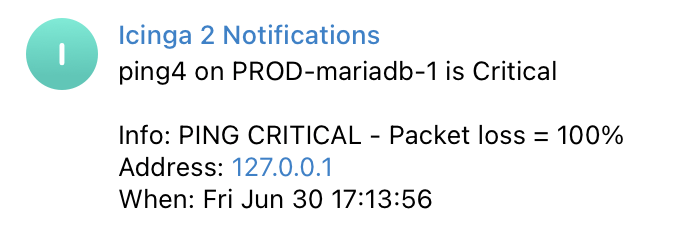

# go-telegram-icinga

go-telegram-icinga was built to send Icinga 2 notifications to Telegram.
* Uses Telegram bot api




## Requirements
* Telegram bot (https://core.telegram.org/bots#how-do-i-create-a-bot)

## Usage
```
Usage of ./go-telegram-icinga
      --hostname string   Hostname
      --address string    Host address
      --service string    Service name
      --output string     Host or service output
      --state string      Host or service state
      --date string       Datetime
      --chatId int        Telegram chat id
      --token string      Telegram bot token
```

